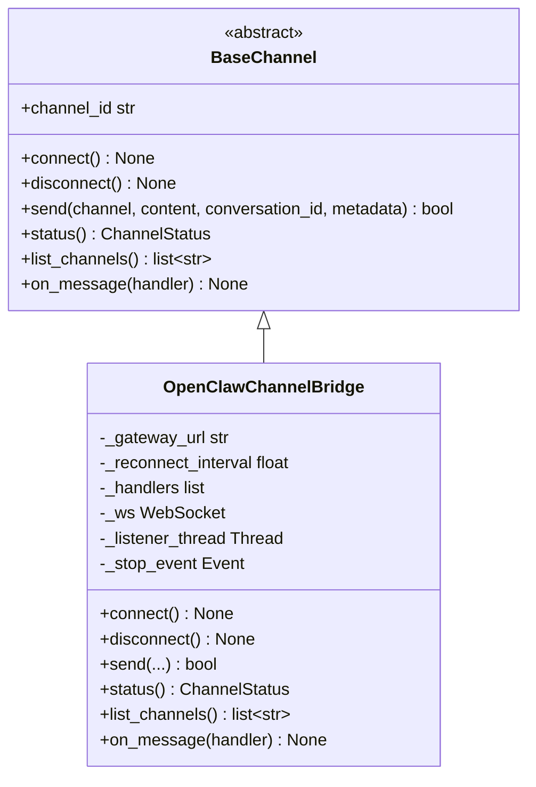
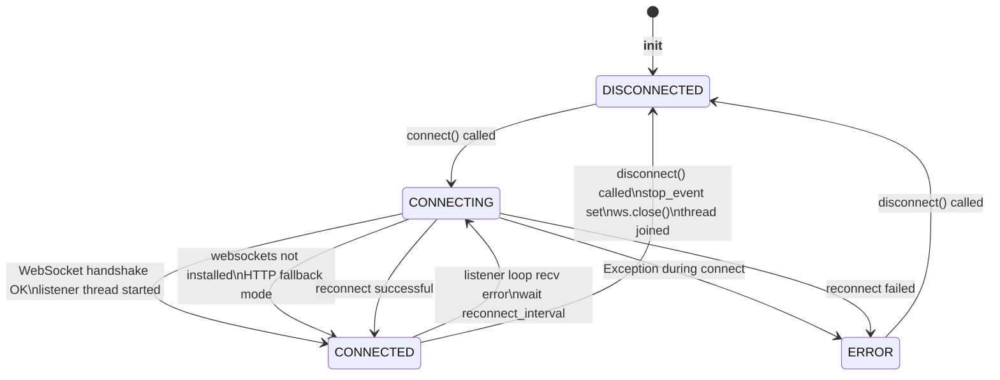
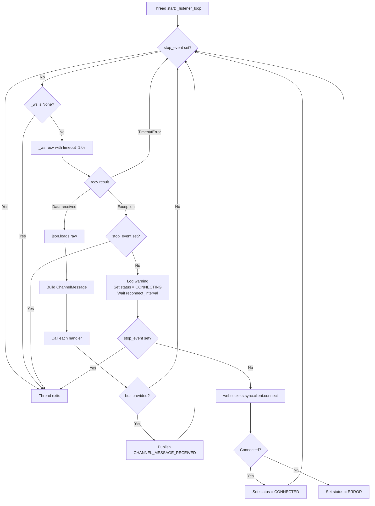
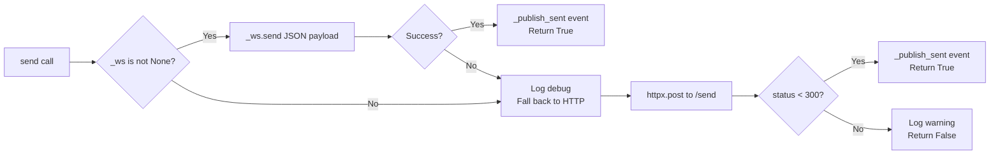
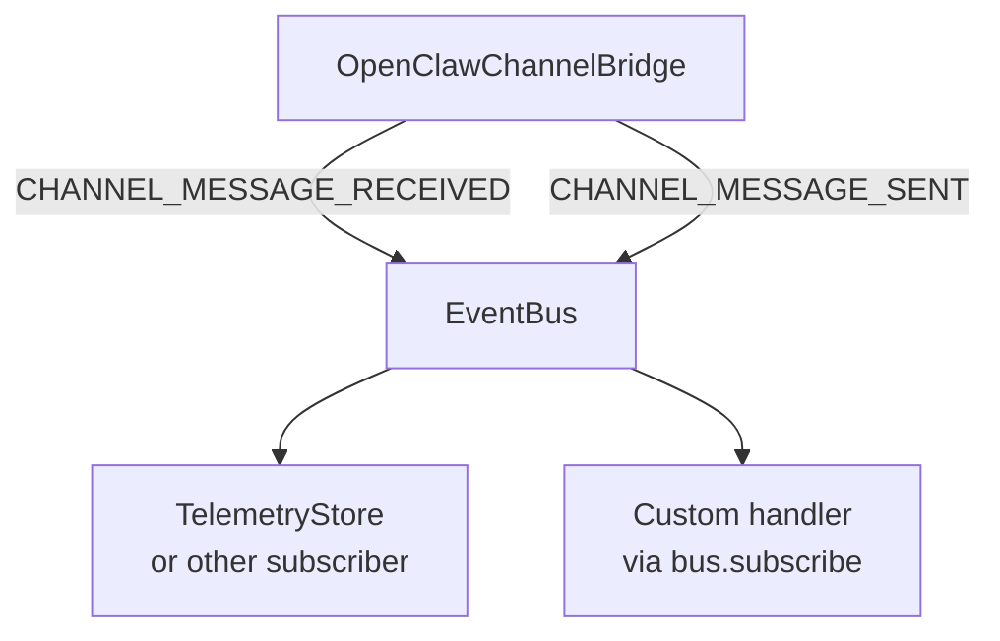

# Channels Architecture

The channels module provides a transport-agnostic messaging layer for receiving and sending messages through external gateways. The design follows the same registry-plus-ABC pattern used throughout OpenJarvis: a `BaseChannel` interface defines the contract, and concrete implementations are registered for runtime discovery.

---

## Design Principles

- **Transport-agnostic ABC.** `BaseChannel` defines six abstract methods covering the full lifecycle: connect, disconnect, send, status, list channels, and message handler registration.
- **Background listener thread.** Incoming messages are delivered via a daemon thread, not an event loop, so channels work from synchronous code without requiring async infrastructure.
- **Resilient reconnection.** The listener loop handles disconnects gracefully with configurable back-off, restoring message delivery automatically after network interruptions.
- **HTTP fallback.** When WebSocket is unavailable, `send()` and `list_channels()` fall back to HTTP so that outbound operations continue to work.

---

## BaseChannel ABC



All `BaseChannel` subclasses must be registered via `@ChannelRegistry.register("name")` to be discoverable at runtime. `OpenClawChannelBridge` is registered as `"openclaw"`.

---

## WebSocket Lifecycle

The full connection lifecycle for `OpenClawChannelBridge` from instantiation through to disconnection:



The `ChannelStatus` enum (`CONNECTED`, `DISCONNECTED`, `CONNECTING`, `ERROR`) tracks this state and is exposed via `status()`.

---

## Listener Loop Internals

The listener loop runs on a daemon thread created in `connect()`. It is the core of the real-time message delivery system.



Key implementation details:

- `recv(timeout=1.0)` uses a one-second timeout so the loop can check `stop_event` periodically even when no messages arrive.
- Handler exceptions are caught and logged individually — a failing handler does not stop message delivery to subsequent handlers.
- The reconnect attempt is a simple `websockets.sync.client.connect()` call. If it fails, the status becomes ERROR and the loop continues, trying again on the next iteration.

---

## Reconnect Strategy

The reconnect strategy is linear wait with no jitter or exponential back-off:

1. Exception caught in listener loop
2. Wait `reconnect_interval` seconds (default: 5.0)
3. Attempt `websockets.sync.client.connect(gateway_url)`
4. If successful: set `CONNECTED`, resume receiving
5. If failed: set `ERROR`, resume loop (go to step 1)

This simple strategy is appropriate for local or LAN gateway connections where reconnection latency is low. For internet-facing gateways, consider subclassing `OpenClawChannelBridge` and overriding `_listener_loop` with exponential back-off.

---

## Send Path and HTTP Fallback

Outbound messages follow a two-tier path:



The HTTP URL is derived from the WebSocket URL by replacing `ws://` with `http://` and stripping the trailing `/ws` path segment. For example: `ws://127.0.0.1:18789/ws` becomes `http://127.0.0.1:18789/send`.

---

## Event Flow

Channel events are published to the `EventBus` using two event types:

| Event | Published By | When | Payload |
|-------|-------------|------|---------|
| `CHANNEL_MESSAGE_RECEIVED` | `_listener_loop` | Message received from gateway | `channel`, `sender`, `content`, `message_id` |
| `CHANNEL_MESSAGE_SENT` | `_publish_sent` | Message successfully delivered | `channel`, `content`, `conversation_id` |

These events allow other modules to react to channel activity without depending on the channel implementation directly. For example, a logging subscriber can record all sent and received messages, or an agent can be wired to respond to incoming channel messages by subscribing to `CHANNEL_MESSAGE_RECEIVED`.



---

## Handler Registration

Multiple handlers can be registered. They are stored in a list and called sequentially within the listener thread. Returning a value from a handler has no effect on message routing — the return type `Optional[str]` is reserved for future use (for example, auto-reply routing).

```python
# ChannelHandler type alias
ChannelHandler = Callable[[ChannelMessage], Optional[str]]
```

Handler exceptions are caught individually:

```python
for handler in self._handlers:
    try:
        handler(msg)
    except Exception:
        logger.exception("Channel handler error")
```

This ensures that a handler that raises an exception does not prevent subsequent handlers from running.

---

## Threading Model

`OpenClawChannelBridge` uses Python's `threading` module rather than asyncio. This is a deliberate choice: OpenJarvis's core inference path is synchronous, and daemon threads are simpler to compose with synchronous code than coroutines.

| Component | Thread | Notes |
|-----------|--------|-------|
| `connect()`, `send()`, `disconnect()` | Caller thread | All public methods are thread-safe |
| `_listener_loop()` | Background daemon thread | Started in `connect()`, joined in `disconnect()` |
| Handler callbacks | Background daemon thread | Called from listener thread — use thread-safe data structures |

!!! warning "Handler thread safety"
    Handler callbacks run on the listener thread, not the thread that called `connect()`. If your handler modifies shared state, protect it with a lock or use thread-safe data structures such as `queue.Queue`.

---

## Adding a New Channel Backend

To add a new channel backend (for example, a Slack channel):

1. Subclass `BaseChannel` and implement all six abstract methods.
2. Set `channel_id` as a class attribute.
3. Decorate with `@ChannelRegistry.register("slack")`.

```python
from openjarvis.channels._stubs import BaseChannel, ChannelMessage, ChannelStatus
from openjarvis.core.registry import ChannelRegistry

@ChannelRegistry.register("slack")
class SlackChannel(BaseChannel):
    channel_id = "slack"

    def connect(self) -> None: ...
    def disconnect(self) -> None: ...
    def send(self, channel, content, *, conversation_id="", metadata=None) -> bool: ...
    def status(self) -> ChannelStatus: ...
    def list_channels(self) -> list[str]: ...
    def on_message(self, handler) -> None: ...
```

After registration, the backend is discoverable via `ChannelRegistry.get("slack")`.

---

## See Also

- [User Guide: Channels](../user-guide/channels.md) — how to use channels in practice
- [API Reference: Channels](../api-reference/openjarvis/channels/index.md) — complete class and type signatures
- [Architecture: Overview](overview.md) — where channels fit in the overall system
- [Architecture: Design Principles](design-principles.md) — registry pattern and ABC conventions
